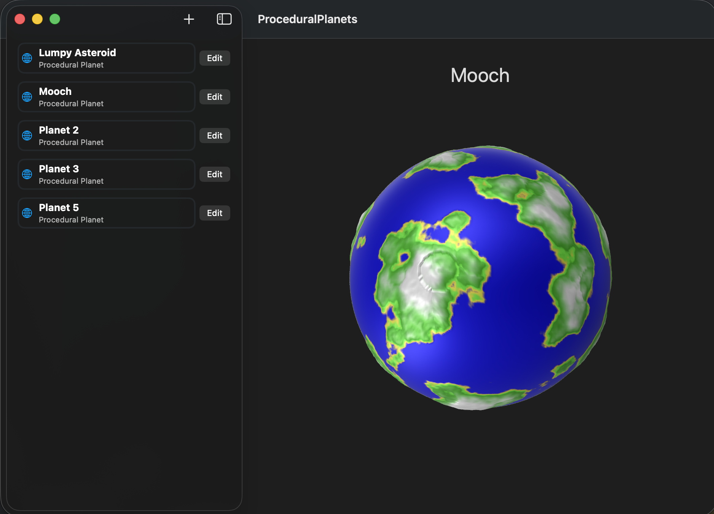

# Procedural Planets in Reality Kit

Requirements: macOS 26 and Xcode 26

The core implementation is a port of https://github.com/SebLague/Procedural-Planets
from Unity to Reality Kit and VisionOS

This implementation allows adding craters as well as deleting gradient colors.
